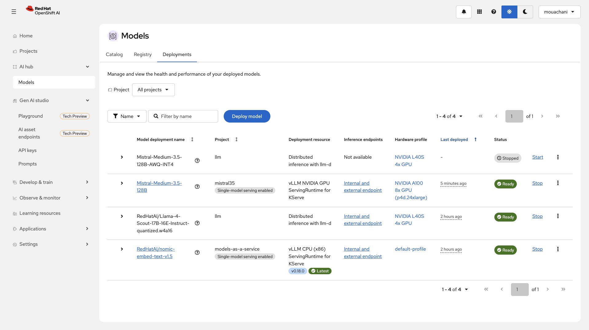
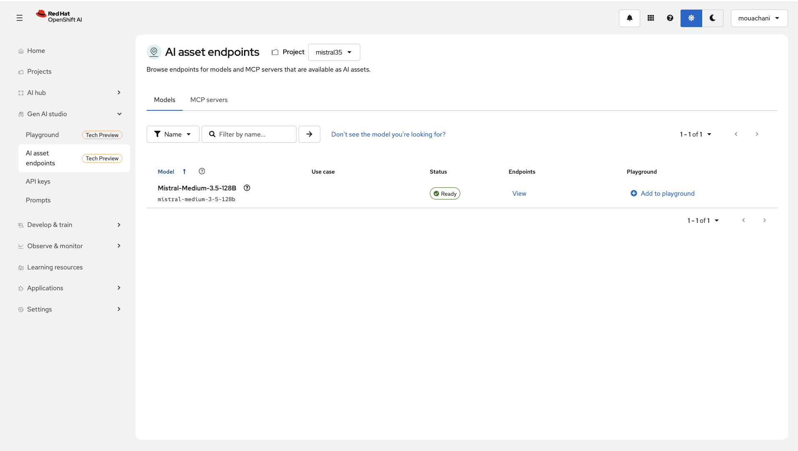
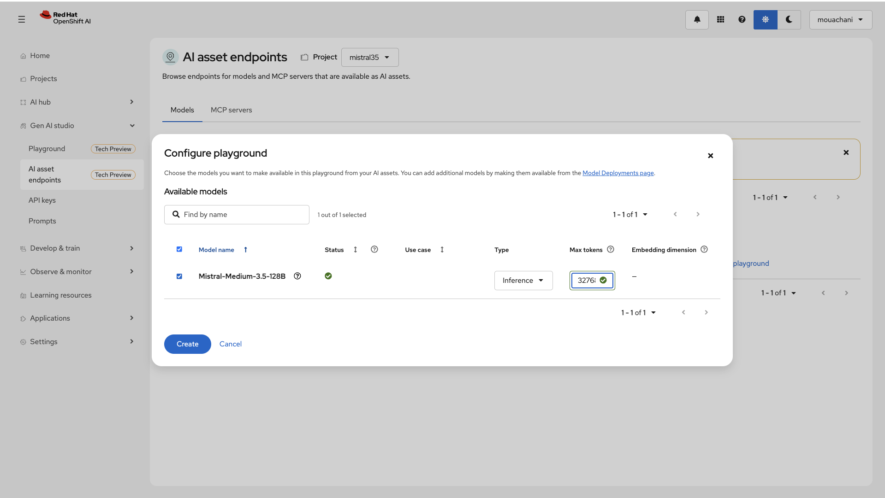
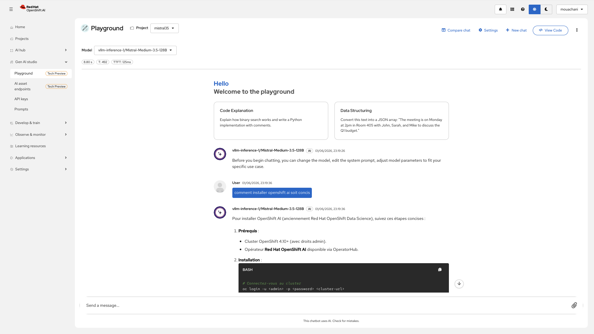
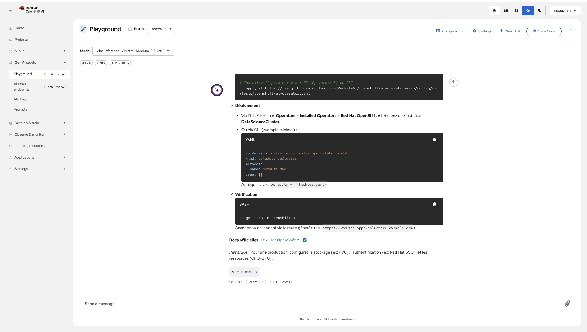
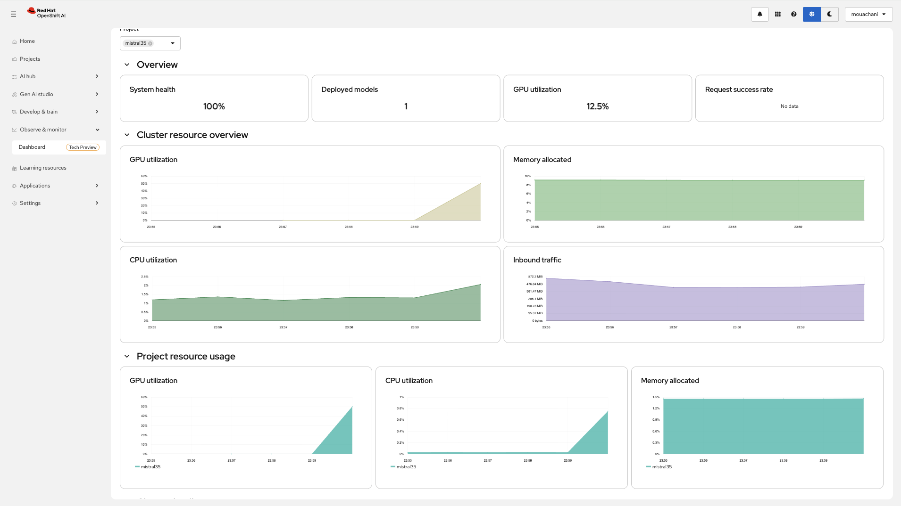
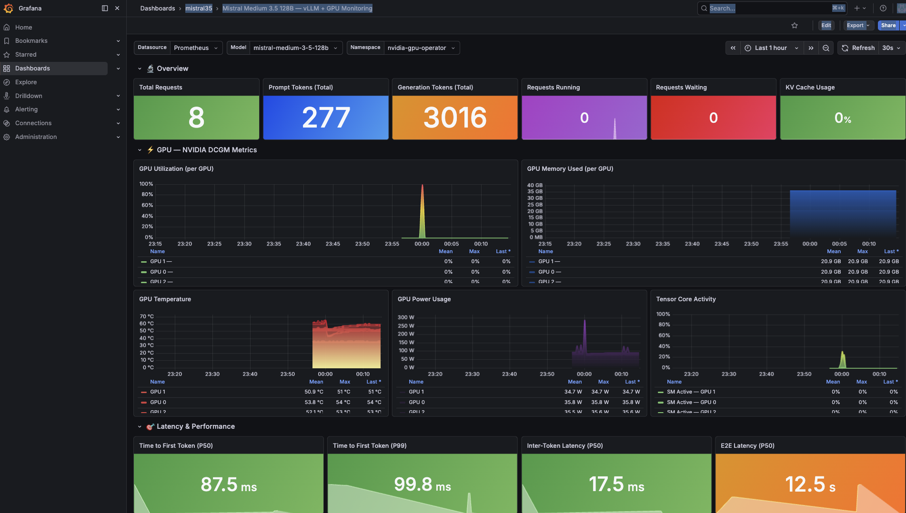
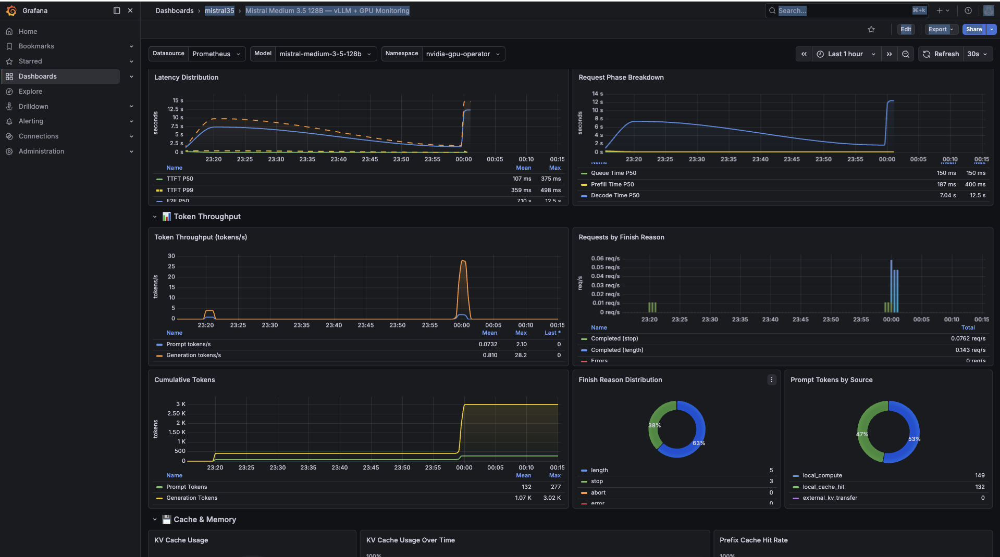
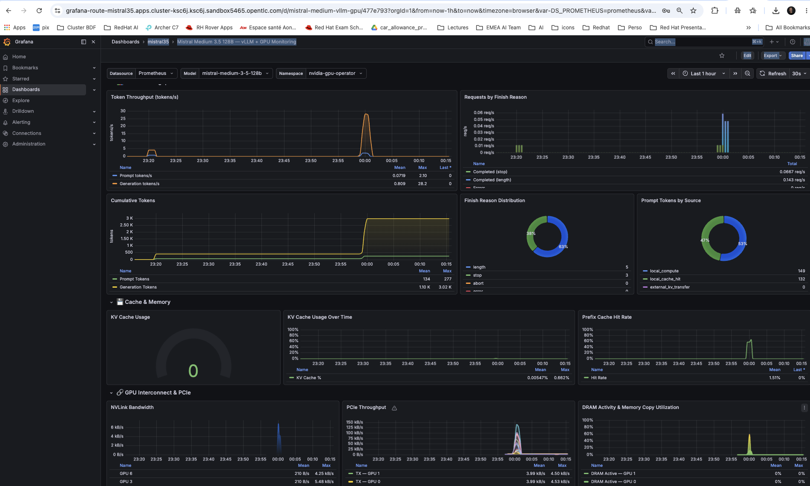

# Mistral Medium 3.5 128B on OpenShift AI

> **Purpose:** This repository provides a **deployment example** for running Mistral Medium 3.5 128B on Red Hat OpenShift AI (RHOAI) using vLLM. The goal is to demonstrate an end-to-end setup — from model download to inference — and validate that the model loads, serves, and responds to API calls correctly. This is **not** a performance benchmark, load test, or Red Hat validated reference architecture.

Helm chart for deploying [Mistral Medium 3.5 128B](https://huggingface.co/mistralai/Mistral-Medium-3.5-128B) on Red Hat OpenShift AI (RHOAI 3.4+) using vLLM as the inference engine.

This chart packages all the Kubernetes resources needed to download, serve, and observe the model end-to-end. It is designed for GitOps workflows (ArgoCD / OpenShift GitOps).

> **Disclaimer:** This is a community deployment example. All metrics, performance figures, and test results presented in this document are **indicative only**, collected from a handful of manual requests on a single environment. They do not represent load testing, capacity planning, or performance validation. Your results will vary depending on hardware, configuration, network, and workload.

## Architecture Overview

```
+---------------------+      +---------------------+      +-------------------+
|  HuggingFace Hub    | ---> |  Download Job        | ---> |  PVC (300 Gi)     |
|  (gated model)      |      |  (huggingface-cli)   |      |  Model weights    |
+---------------------+      +---------------------+      +--------+----------+
                                                                    |
                              +---------------------+               |
                              |  ServingRuntime      |               |
                              |  (vLLM + custom log) | <-------------+
                              +--------+------------+
                                       |
                              +--------v------------+
                              |  InferenceService    |
                              |  OpenAI-compatible   |
                              |  /v1/chat/completions|
                              +---------------------+
```

## What Gets Deployed

| Resource | Template | Description |
|----------|----------|-------------|
| **Secret** | `secret-hf-token.yaml` | HuggingFace access token for downloading the gated model |
| **PersistentVolumeClaim** | `pvc.yaml` | Storage for model weights (~128 GB for FP8) |
| **Job** | `job-download.yaml` | One-shot job that downloads model weights from HuggingFace to the PVC |
| **HardwareProfile** | `hardwareprofile.yaml` | RHOAI resource profile visible in the OpenShift AI dashboard |
| **ConfigMap** | `configmap-logging.yaml` | vLLM logging configuration (JSON formatter for EFK/Kibana) |
| **ServingRuntime** | `servingruntime.yaml` | KServe ServingRuntime with vLLM, custom args, and logging |
| **InferenceService** | `inferenceservice.yaml` | KServe InferenceService exposing the model as an OpenAI-compatible API |
| **Benchmark Job** | `benchmark-job.yaml` | Submits a GuideLLM benchmark to EvalHub (disabled by default) |

## Prerequisites

- OpenShift 4.x cluster with RHOAI 3.4+ operator installed
- NVIDIA GPU operator installed and configured
- GPU nodes available (see [GPU Requirements](#gpu-requirements))
- A HuggingFace account with access granted to [mistralai/Mistral-Medium-3.5-128B](https://huggingface.co/mistralai/Mistral-Medium-3.5-128B) (gated model, requires license acceptance)
- A HuggingFace [User Access Token](https://huggingface.co/settings/tokens)
- Helm 3.x

## GPU Requirements

Mistral Medium 3.5 is a **128B parameter dense multimodal model** (text + vision). It includes a vision encoder trained from scratch. The full model weights are available in BF16 and FP8 formats.

| Precision | Model Size | Minimum Hardware | Example Instance |
|-----------|-----------|-----------------|-----------------|
| **BF16** | ~256 GB | 4x A100 80GB or 8x A100 40GB | AWS `p4d.24xlarge` (8x A100 40GB) |
| **FP8** | ~128 GB | 2x A100 80GB or 4x A100 40GB | AWS `p4d.24xlarge` (8x A100 40GB) |

The default configuration targets **8x NVIDIA A100 40GB** (AWS `p4d.24xlarge`):
- 96 vCPU, 1152 GiB RAM, 8x A100 40GB (320 GB total VRAM)
- `tensor-parallel-size=8` distributes the model across all 8 GPUs
- `gpu-memory-utilization=0.90` reserves 10% headroom for CUDA overhead

## Quick Start

```bash
# Create the namespace
oc new-project mistral35

# Install the chart
helm install mistral-medium . \
  --namespace mistral35 \
  --set secret.hfToken=<your-hf-token> \
  --wait=false
```

> **Note:** `--wait=false` is important because the download job takes 30-60 minutes to complete. The predictor pod will restart (CrashLoopBackOff) until the model weights are fully downloaded to the PVC.

## Configuration Reference

### Model

| Parameter | Default | Description |
|-----------|---------|-------------|
| `model.name` | `mistral-medium-3-5-128b` | Model identifier used in served model name |
| `model.displayName` | `Mistral-Medium-3.5-128B` | Human-readable name for RHOAI dashboard |
| `model.huggingfaceRepo` | `mistralai/Mistral-Medium-3.5-128B` | HuggingFace repository to download from |
| `model.localDir` | `Mistral-Medium-3.5-128B` | Directory name inside the PVC |

### Storage

| Parameter | Default | Description |
|-----------|---------|-------------|
| `storage.pvc.name` | `mistral-medium-3-5-pvc` | PVC name for model weights |
| `storage.pvc.size` | `300Gi` | PVC size (must be > 2x model size for download temp files) |
| `storage.pvc.storageClass` | `gp3-csi` | Kubernetes StorageClass |
| `storage.pvc.accessMode` | `ReadWriteOnce` | PVC access mode |

### Download Job

| Parameter | Default | Description |
|-----------|---------|-------------|
| `download.enabled` | `true` | Enable/disable the model download job |
| `download.image` | `registry.access.redhat.com/ubi9/python-311:latest` | Container image for the download job |

### HuggingFace Secret

| Parameter | Default | Description |
|-----------|---------|-------------|
| `secret.hfToken` | `REPLACE_WITH_YOUR_HF_TOKEN` | HuggingFace access token. **Pass via `--set` at install time, never commit real tokens.** |

### Hardware Profile

| Parameter | Default | Description |
|-----------|---------|-------------|
| `hardwareProfile.name` | `nvidia-a100-8gpu` | Profile name in RHOAI dashboard |
| `hardwareProfile.gpu.count` | `8` | Default GPU count |
| `hardwareProfile.cpu.count` | `90` | Default CPU allocation |
| `hardwareProfile.memory.count` | `1100Gi` | Default memory allocation |

### vLLM Inference Arguments

| Parameter | Default | Description |
|-----------|---------|-------------|
| `inference.vllm.tensorParallelSize` | `8` | Number of GPUs for tensor parallelism |
| `inference.vllm.maxModelLen` | `32768` | Maximum sequence length (model supports up to 256k) |
| `inference.vllm.gpuMemoryUtilization` | `0.90` | Fraction of GPU memory allocated to model + KV cache |
| `inference.vllm.enforceEager` | `false` | Disable CUDA graphs (saves memory, slower inference) |
| `inference.vllm.enablePrefixCaching` | `true` | Enable KV cache prefix sharing across requests |
| `inference.vllm.dtype` | `auto` | Model data type (auto-detected from weights) |
| `inference.vllm.enableAutoToolChoice` | `true` | Enable native function/tool calling |
| `inference.vllm.toolCallParser` | `mistral` | Tool call parser (use `mistral` for Mistral models) |
| `inference.vllm.maxNumBatchedTokens` | `16384` | Maximum tokens processed in a single batch |

### Deployment Strategy

| Parameter | Default | Description |
|-----------|---------|-------------|
| `inference.strategy` | `RollingUpdate` | `RollingUpdate` or `Recreate` |

```bash
# Rolling update (default) - requires 2x GPU capacity during rollout
helm install mistral-medium . --set inference.strategy=RollingUpdate

# Recreate - zero downtime not guaranteed, but no extra GPU needed
helm install mistral-medium . --set inference.strategy=Recreate
```

### Runtime Selection

The chart supports two vLLM runtimes:

```bash
# Red Hat certified vLLM runtime (default)
helm install mistral-medium . --set servingRuntime.useRedHatRuntime=true

# Custom vLLM image (e.g., with additional Python packages for logging)
helm install mistral-medium . \
  --set servingRuntime.useRedHatRuntime=false \
  --set servingRuntime.custom.image=quay.io/your-org/vllm-custom:latest
```

Use a custom runtime when you need:
- Additional Python packages (e.g., `python-json-logger` for JSON log formatting)
- Custom middleware or request preprocessing
- Patched vLLM version

## Custom Logging

vLLM logging is fully configurable via a JSON configuration file mounted as a ConfigMap. This enables structured logging for ingestion into **Kibana / EFK / OpenShift Logging**.

### How It Works

1. The `configmap-logging.yaml` template renders the `logging.config` values into a `logging_config.json` file
2. The ConfigMap is mounted at `/etc/vllm/logging_config.json` inside the vLLM container
3. The environment variable `VLLM_LOGGING_CONFIG_PATH` points vLLM to this config file
4. vLLM uses Python's `logging.config.dictConfig()` to apply the configuration at startup

### Default Configuration (JSON format)

```json
{
  "version": 1,
  "formatters": {
    "json": {
      "class": "pythonjsonlogger.jsonlogger.JsonFormatter",
      "format": "%(asctime)s %(name)s %(levelname)s %(message)s %(pathname)s %(lineno)d"
    }
  },
  "handlers": {
    "console": {
      "class": "logging.StreamHandler",
      "formatter": "json",
      "level": "INFO",
      "stream": "ext://sys.stdout"
    }
  },
  "loggers": {
    "vllm": {
      "handlers": ["console"],
      "level": "INFO",
      "propagate": false
    }
  }
}
```

### Customizing Log Format

Override the logging config in your `values.yaml` or via `--set`:

```bash
# Change log level to DEBUG
helm install mistral-medium . --set logging.config.loggers.vllm.level=DEBUG

# Disable custom logging entirely (use vLLM defaults)
helm install mistral-medium . --set logging.enabled=false
```

To use the **plain text** formatter instead of JSON:

```yaml
logging:
  config:
    handlers:
      console:
        formatter: plain  # instead of "json"
```

### Access Log Filtering

Health check and metrics endpoints are excluded from access logs by default to reduce noise:

```
/health, /metrics, /ping
```

This is controlled by `logging.disableAccessLogEndpoints`.

### Log Output Examples

**Default vLLM logs (without custom logging):**

```
INFO 06-01 14:32:10 api_server.py:234] vLLM API server started on port 8000
INFO 06-01 14:32:15 engine.py:112] Loading model mistral-medium-3-5-128b...
INFO 06-01 14:32:45 metrics.py:89] Avg prompt throughput: 1024.0 tokens/s, Avg generation throughput: 45.2 tokens/s
```

Plain text logs are human-readable but difficult to parse, filter, and aggregate in centralized logging systems (EFK, Kibana, Splunk).

**With custom JSON logging enabled (default in this chart):**

```json
{"asctime": "2026-06-01 14:32:10,234", "name": "vllm.entrypoints.openai.api_server", "levelname": "INFO", "message": "vLLM API server started on port 8000", "pathname": "/opt/vllm/vllm/entrypoints/openai/api_server.py", "lineno": 234}
{"asctime": "2026-06-01 14:32:15,891", "name": "vllm.engine.async_llm_engine", "levelname": "INFO", "message": "Loading model mistral-medium-3-5-128b...", "pathname": "/opt/vllm/vllm/engine.py", "lineno": 112}
{"asctime": "2026-06-01 14:32:45,567", "name": "vllm.engine.metrics", "levelname": "INFO", "message": "Avg prompt throughput: 1024.0 tokens/s, Avg generation throughput: 45.2 tokens/s", "pathname": "/opt/vllm/vllm/engine/metrics.py", "lineno": 89}
```

Structured JSON logs enable:
- **Filtering** by log level, logger name, or source file in Kibana/EFK
- **Alerting** on specific patterns (e.g., `levelname: "ERROR"`)
- **Correlation** with request tracing via timestamps and source locations
- **Noise reduction** via `disableAccessLogEndpoints` which excludes `/health`, `/metrics`, and `/ping` from access logs

### Important: python-json-logger Dependency

The JSON formatter (`pythonjsonlogger.jsonlogger.JsonFormatter`) requires the `python-json-logger` package. If it is **not pre-installed** in the vLLM image:

- The Red Hat vLLM image may not include it. In that case, vLLM will fall back to the default formatter or crash.
- **Solution**: Either build a custom vLLM image with the package, or switch to the `plain` formatter which has no extra dependencies.

```dockerfile
# Example custom vLLM Dockerfile
FROM registry.redhat.io/rhaii/vllm-cuda-rhel9@sha256:ad06abf3bb...
RUN pip install --no-cache-dir python-json-logger
```

Then deploy with:
```bash
helm install mistral-medium . \
  --set servingRuntime.useRedHatRuntime=false \
  --set servingRuntime.custom.image=quay.io/your-org/vllm-custom:latest
```

## GitOps Usage

This chart is designed for ArgoCD / OpenShift GitOps. Create per-environment values files:

```
values.yaml              # Defaults
values-dev.yaml          # Dev overrides (smaller model len, fewer GPUs)
values-staging.yaml      # Staging
values-prod.yaml         # Production (full config)
```

Example ArgoCD Application:

```yaml
apiVersion: argoproj.io/v1alpha1
kind: Application
metadata:
  name: mistral-medium
  namespace: openshift-gitops
spec:
  project: default
  source:
    repoURL: https://github.com/mouachan/mistral-35
    targetRevision: main
    helm:
      valueFiles:
        - values-prod.yaml
      parameters:
        - name: secret.hfToken
          value: $HF_TOKEN  # injected from ArgoCD secret
  destination:
    server: https://kubernetes.default.svc
    namespace: mistral35
```

## RHOAI Dashboard

### Model Deployments

The model appears as **Ready** in the RHOAI Models > Deployments view, with the correct hardware profile (NVIDIA A100 8x GPU) and serving runtime (vLLM NVIDIA GPU ServingRuntime for KServe).



## MaaS Integration (Models as a Service)

Once deployed, the model appears in the RHOAI **AI asset endpoints** dashboard and can be added to a **Playground** for interactive testing.

### AI Asset Endpoints



### Configure Playground

Set **Max tokens** to `32768` (matching the `max-model-len` configured in vLLM).



### Playground in Action

**Question:** "comment installer openshift ai soit concis"



**Response:** Complete step-by-step guide with CLI commands and YAML examples.



**Performance metrics:** 8.80s total | 492 tokens | TTFT: 125ms

> **Note:** Playground and Grafana metrics were captured during separate sessions with different prompts and response lengths. Variations between the two (e.g., TTFT 125 ms vs 87.5 ms) are expected.

## Observability Dashboard (Tech Preview)

The RHOAI built-in **Observe & monitor > Dashboard** provides real-time visibility into GPU, CPU, memory, and network usage at both cluster and project level.



Key metrics displayed:
- **Overview** — System health (100%), deployed models count, GPU utilization (12.5%), request success rate
- **Cluster resource overview** — GPU utilization, memory allocated, CPU utilization, inbound traffic over time
- **Project resource usage** — Per-namespace breakdown (GPU, CPU, memory) with the `mistral35` project highlighted

> **Note:** GPU metrics require a `ServiceMonitor` for the NVIDIA DCGM exporter. If GPU utilization shows "No data", enable it in the GPU operator ClusterPolicy:
> ```bash
> oc patch clusterpolicy gpu-cluster-policy --type=merge \
>   -p '{"spec":{"dcgmExporter":{"serviceMonitor":{"enabled":true}}}}'
> ```
> This is persistent — the GPU operator maintains the ServiceMonitor across restarts. Do **not** create a ServiceMonitor manually as it will be deleted by the operator.

## Grafana Dashboard

The Helm chart includes an optional Grafana deployment (via the [Grafana Operator](https://github.com/grafana/grafana-operator)) with a pre-configured dashboard for deep observability beyond the RHOAI built-in dashboard.

When `grafana.enabled=true`, the chart deploys:
- A **Grafana instance** with an OpenShift Route (HTTPS)
- A **ServiceAccount** with `cluster-monitoring-view` permissions to query Prometheus/Thanos
- A **GrafanaDatasource** pointing to the OpenShift Thanos Querier
- A **GrafanaDashboard** loaded from [`grafana/mistral-medium-dashboard.json`](grafana/mistral-medium-dashboard.json)

### Prerequisites

The Grafana Operator must be installed on the cluster before enabling this feature:

```bash
# Install the Grafana Operator from OperatorHub (AllNamespaces mode)
# Or via CLI:
oc apply -f - <<EOF
apiVersion: operators.coreos.com/v1alpha1
kind: Subscription
metadata:
  name: grafana-operator
  namespace: openshift-operators
spec:
  channel: v5
  name: grafana-operator
  source: community-operators
  sourceNamespace: openshift-marketplace
EOF
```

### Deployment

```bash
# Create a ServiceAccount token for Prometheus access
oc create sa grafana-prometheus -n mistral35
oc adm policy add-cluster-role-to-user cluster-monitoring-view -z grafana-prometheus -n mistral35
SA_TOKEN=$(oc create token grafana-prometheus -n mistral35 --duration=87600h)

# Install/upgrade with Grafana enabled
helm upgrade --install mistral-medium . \
  --namespace mistral35 \
  --set secret.hfToken=<your-hf-token> \
  --set grafana.enabled=true \
  --set grafana.datasource.token=$SA_TOKEN
```

### Configuration

| Parameter | Default | Description |
|-----------|---------|-------------|
| `grafana.enabled` | `true` | Enable/disable Grafana deployment |
| `grafana.adminUser` | `admin` | Grafana admin username |
| `grafana.adminPassword` | `admin` | Grafana admin password. **Change in production.** |
| `grafana.datasource.url` | `https://thanos-querier.openshift-monitoring.svc.cluster.local:9091` | Prometheus/Thanos endpoint |
| `grafana.datasource.token` | `REPLACE_WITH_SA_TOKEN` | ServiceAccount bearer token. **Pass via `--set` at install time.** |

### Dashboard Sections

The dashboard is organized into 6 sections covering both vLLM application metrics and NVIDIA GPU hardware metrics:



**Overview** — KPIs at a glance: total requests (8), prompt tokens (277), generation tokens (3016), requests running/waiting, and KV cache usage percentage.

**GPU — NVIDIA DCGM Metrics** — Per-GPU hardware monitoring sourced from the DCGM exporter:
- GPU utilization (%) with spike visualization during inference
- GPU memory used (~20.9 GB per GPU for the 128B model in FP8)
- GPU temperature (50-54 C under load)
- Power usage (~35 W idle per A100)
- Tensor core activity (SM Active + Tensor Active)



**Latency & Performance** — Real-time latency tracking:
- Time to First Token: P50 = 87.5 ms, P99 = 99.8 ms
- Inter-Token Latency: P50 = 17.5 ms (~57 tokens/s generation speed)
- E2E Latency: P50 = 12.5 s (for 500-token responses)
- Latency distribution with P50/P99 trendlines (dashed = P99)
- Request phase breakdown: Queue (150 ms), Prefill (187 ms), Decode (7.04 s)

**Token Throughput** — Token generation analytics:
- Real-time tokens/s (prompt: 2.10 peak, generation: 28.2 peak)
- Requests by finish reason: stop (natural end) vs length (max_tokens reached) vs error/abort
- Cumulative tokens over time (prompt: 277, generation: 3.02K)
- Finish reason distribution (donut): 63% length, 37% stop
- Prompt tokens by source (donut): 53% local_compute, 47% local_cache_hit (prefix caching working)



**Cache & Memory** — KV cache and prefix cache monitoring:
- KV cache usage gauge (0% when idle, watch for saturation > 90%)
- KV cache usage over time (mean: 0.005%, max: 0.86% — healthy headroom)
- Prefix cache hit rate (1.51% mean — increases with repeated prompts)

**GPU Interconnect & PCIe** — Inter-GPU communication for tensor parallelism:
- NVLink bandwidth (GPU-to-GPU, ~210 B/s idle, 4.25 kB/s peak)
- PCIe throughput TX/RX (~4 kB/s during inference)
- DRAM activity and memory copy utilization per GPU

### Variables

| Variable | Description | Default |
|----------|-------------|---------|
| `DS_PROMETHEUS` | Prometheus datasource | Auto-detected |
| `model` | vLLM model name (auto-populated from Prometheus) | `mistral-medium-3-5-128b` |
| `namespace` | Namespace for DCGM GPU metrics | `nvidia-gpu-operator` |

> **Important:** The **Namespace** variable must be set to `nvidia-gpu-operator` for GPU metrics (DCGM) to appear. This is the namespace where the NVIDIA DCGM exporter runs, not the model namespace. If left empty, all GPU panels will show "No data".

## Testing the Deployment

Once the download job completes and the predictor pod is `Running` and `Ready`:

```bash
# Port-forward to the inference service
oc port-forward svc/mistral-medium-3-5-128b-predictor 8000:80 -n mistral35

# Send a chat completion request
curl http://localhost:8000/v1/chat/completions \
  -H "Content-Type: application/json" \
  -d '{
    "model": "mistral-medium-3-5-128b",
    "messages": [{"role": "user", "content": "Hello, who are you?"}],
    "max_tokens": 100
  }'
```

## Deployment Smoke Tests

The following smoke tests were run against the deployed model to verify that it loads and responds correctly. They are **not** performance benchmarks or load tests — they simply confirm that the inference endpoint works end-to-end.

Environment: 8x A100 40GB cluster (p4d.24xlarge) with `tensor-parallel-size=8` and `max-model-len=32768`.

### Test 1 — General Knowledge

```bash
curl -s http://localhost:8000/v1/chat/completions \
  -H "Content-Type: application/json" \
  -d '{
    "model": "mistral-medium-3-5-128b",
    "messages": [{"role": "user", "content": "Explain quantum computing in 2 sentences."}],
    "max_tokens": 100
  }'
```

**Result:** Coherent 2-sentence explanation covering qubits, superposition, and entanglement.

> Quantum computing uses **quantum bits (qubits)** that can exist in **superpositions** of states (0 and 1 simultaneously) and leverage **entanglement** to perform complex calculations exponentially faster than classical computers for specific problems. By harnessing quantum mechanics principles like interference and decoherence control, it enables breakthroughs in fields like cryptography, optimization, and drug discovery.

| Metric | Value |
|--------|-------|
| Finish reason | `stop` |
| Prompt / Completion tokens | 24 / 78 |

### Test 2 — Code Generation

```bash
curl -s http://localhost:8000/v1/chat/completions \
  -H "Content-Type: application/json" \
  -d '{
    "model": "mistral-medium-3-5-128b",
    "messages": [{"role": "user", "content": "Write a Python function that checks if a number is prime. Include examples."}],
    "max_tokens": 500
  }'
```

**Result:** Complete `is_prime()` function with edge-case handling (`n <= 1`, even numbers, divisors up to sqrt) and usage examples. Truncated at `max_tokens`.

| Metric | Value |
|--------|-------|
| Finish reason | `length` |
| Prompt / Completion tokens | 30 / 500 |

### Test 3 — Structured JSON Output

```bash
curl -s http://localhost:8000/v1/chat/completions \
  -H "Content-Type: application/json" \
  -d '{
    "model": "mistral-medium-3-5-128b",
    "messages": [
      {"role": "system", "content": "You are a helpful assistant that responds in JSON format."},
      {"role": "user", "content": "List the 3 largest countries by area with their capital and population."}
    ],
    "max_tokens": 300
  }'
```

**Result:** Well-formed JSON with Russia, Canada, and United States including area (km2), capital, and population.

> ```json
> {"largest_countries_by_area": [
>   {"country": "Russia", "area_sq_km": 17098242, "capital": "Moscow", "population": 145934462},
>   {"country": "Canada", "area_sq_km": 9984670, "capital": "Ottawa", "population": 37742154},
>   {"country": "United States", "area_sq_km": 9833517, "capital": "Washington, D.C.", "population": 331002651}
> ]}
> ```

| Metric | Value |
|--------|-------|
| Finish reason | `stop` |
| Prompt / Completion tokens | 42 / 203 |

### Test 4 — Translation

```bash
curl -s http://localhost:8000/v1/chat/completions \
  -H "Content-Type: application/json" \
  -d '{
    "model": "mistral-medium-3-5-128b",
    "messages": [{"role": "user", "content": "Translate to Japanese: The weather is beautiful today."}],
    "max_tokens": 100
  }'
```

**Result:** Correct Japanese translation with furigana.

> 今日（きょう）は天気（てんき）がとても良い（よい）です。

| Metric | Value |
|--------|-------|
| Finish reason | `stop` |
| Prompt / Completion tokens | 25 / 31 |

### Test 5 — Tool / Function Calling

```bash
curl -s http://localhost:8000/v1/chat/completions \
  -H "Content-Type: application/json" \
  -d '{
    "model": "mistral-medium-3-5-128b",
    "messages": [{"role": "user", "content": "What is the weather in Paris?"}],
    "tools": [{
      "type": "function",
      "function": {
        "name": "get_weather",
        "description": "Get current weather for a location",
        "parameters": {
          "type": "object",
          "properties": {
            "location": {"type": "string", "description": "City name"}
          },
          "required": ["location"]
        }
      }
    }],
    "max_tokens": 100
  }'
```

**Result:** Model correctly invoked `get_weather({"location": "Paris"})` via `--tool-call-parser mistral`.

| Metric | Value |
|--------|-------|
| Finish reason | `tool_calls` |
| Prompt / Completion tokens | 90 / 12 |

### Summary

| Test | Category | Status | Finish Reason | Completion Tokens |
|------|----------|--------|---------------|-------------------|
| 1 | General Knowledge | Passed | `stop` | 78 |
| 2 | Code Generation | Passed | `length` | 500 |
| 3 | Structured JSON | Passed | `stop` | 203 |
| 4 | Translation | Passed | `stop` | 31 |
| 5 | Tool Calling | Passed | `tool_calls` | 12 |

All tests passed on the **Red Hat certified vLLM runtime** (`registry.redhat.io/rhaii/vllm-cuda-rhel9`) with FP8 precision (weights loaded via Marlin kernels).

> **Note:** These are functional smoke tests only. For performance metrics (TTFT, throughput, latency), refer to the [Grafana dashboard](#grafana-dashboard) (Prometheus metrics) or run [GuideLLM](#performance-benchmarking-optional).

### Running the Smoke Tests

Both tests run as **Kubernetes Jobs** on the cluster (direct network access to the InferenceService, no port-forward needed):

```bash
# Create the results PVC (shared by both jobs)
oc apply -f tests/pvc-results.yaml -n mistral35

# Run smoke tests
oc apply -f tests/smoke-tests-job.yaml -n mistral35

# Follow logs
oc logs -f job/smoke-tests -n mistral35

# Retrieve results locally
oc cp mistral35/$(oc get pod -l job-name=smoke-tests -n mistral35 -o jsonpath='{.items[0].metadata.name}'):/results ./tests/results/
```

A local script (`tests/smoke-tests.sh`) is also available for running tests from your workstation via port-forward.

## Performance Benchmarking (Optional)

For real performance benchmarking (throughput, latency under load, TTFT distributions), use [GuideLLM](https://github.com/vllm-project/guidellm) — a benchmarking tool maintained under the vLLM project and used by Red Hat AI Services.

> **Note:** The metrics shown in the Grafana section above are **not** benchmark results. For proper performance evaluation on your environment, run GuideLLM as described below.

```bash
# Run GuideLLM as a Job on the cluster
oc apply -f tests/guidellm-job.yaml -n mistral35

# Follow logs
oc logs -f job/guidellm-benchmark -n mistral35

# Retrieve results (JSON + CSV + HTML dashboard)
oc cp mistral35/$(oc get pod -l job-name=guidellm-benchmark -n mistral35 -o jsonpath='{.items[0].metadata.name}'):/results/guidellm ./tests/results/guidellm/

# Open the interactive HTML dashboard
open tests/results/guidellm/*.html
```

GuideLLM generates an **interactive HTML report** with charts for latency distributions, throughput, and token generation patterns.

Red Hat also provides a pipeline for running GuideLLM on OpenShift AI: [rh-aiservices-bu/guidellm-pipeline](https://github.com/rh-aiservices-bu/guidellm-pipeline).

## EvalHub — Centralized Evaluation (RHOAI 3.4)

[EvalHub](https://docs.redhat.com/en/documentation/red_hat_openshift_ai_self-managed/3.4/html/evaluating_ai_systems/) is the RHOAI evaluation orchestration service. It provides a REST API for submitting benchmark jobs (GuideLLM, lm-evaluation-harness, garak, lighteval, ibm-clear) with automatic MLflow integration.

EvalHub is a **centralized service** — deployed once and shared across all models. Benchmark jobs run in tenant namespaces (e.g., `mistral35`). Results are exported to MLflow and visible in the RHOAI **Evaluations** dashboard.

### Deploy EvalHub (one-time cluster setup)

Manifests are in the [`evalhub/`](evalhub/) directory. See [`evalhub/README.md`](evalhub/README.md) for full instructions.

```bash
# 1. Enable the EvalHub controller (RHOAI 3.4 only)
oc scale deployment rhods-operator -n redhat-ods-operator --replicas=0
oc patch deployment trustyai-service-operator-controller-manager \
  -n redhat-ods-applications --type=json \
  -p '[{"op":"replace","path":"/spec/template/spec/containers/0/args",
       "value":["--leader-elect","--enable-services","NEMO_GUARDRAILS,EVALHUB"]}]'
oc annotate deployment trustyai-service-operator-controller-manager \
  -n redhat-ods-applications opendatahub.io/managed='false'
oc scale deployment rhods-operator -n redhat-ods-operator --replicas=3

# 2. Deploy PostgreSQL backend
oc apply -f evalhub/namespace.yaml
oc apply -f evalhub/db-secret.yaml        # edit password first!
oc apply -f evalhub/postgresql.yaml

# 3. Apply RBAC (required on RHOAI 3.4, automatic on 3.5+)
oc apply -f evalhub/rbac.yaml

# 4. Deploy EvalHub CR
oc apply -f evalhub/evalhub-cr.yaml

# 5. Register tenant namespace
oc label namespace mistral35 \
  evalhub.trustyai.opendatahub.io/tenant="true" \
  opendatahub.io/dashboard="true"
sed 's/TENANT_NAMESPACE/mistral35/g' evalhub/tenant-rbac.yaml | oc apply -f -
```

### Pin EvalHub Server to v0.3.0 (required on RHOAI 3.4)

The TrustyAI operator config uses `quay.io/evalhub/evalhub:latest` which resolves to v0.4.x. This version requires an `X-User` HTTP header that the RHOAI 3.4 dashboard proxy and job sidecar do not send, causing **"Evaluations unavailable"** in the dashboard and **400 errors** from the sidecar.

The RHOAI 3.4 documentation references EvalHub **v0.3.0**. Pin all images to this version:

```bash
# 1. Scale down the TrustyAI operator to prevent reconciliation
oc scale deployment trustyai-service-operator-controller-manager \
  -n redhat-ods-applications --replicas=0

# 2. Update the EvalHub deployment image
oc set image deployment/evalhub -n redhat-ods-applications \
  evalhub=quay.io/evalhub/evalhub:0.3.0

# 3. Update evalhub-config ConfigMap (sidecar + init images + disable auth)
oc get configmap evalhub-config -n redhat-ods-applications -o json | \
  python3 -c "
import json, sys, yaml
cm = json.load(sys.stdin)
config = yaml.safe_load(cm['data']['config.yaml'])
config['service']['disable_auth'] = True
config['service']['eval_init_image'] = 'quay.io/evalhub/evalhub:0.3.0'
config['service']['eval_sidecar_image'] = 'quay.io/evalhub/evalhub:0.3.0'
config['sidecar']['sidecar_container']['image'] = 'quay.io/evalhub/evalhub:0.3.0'
cm['data']['config.yaml'] = yaml.dump(config, default_flow_style=False)
json.dump(cm, sys.stdout)
" | oc replace -f -

# 4. Verify EvalHub is healthy on v0.3.0
oc rollout status deployment/evalhub -n redhat-ods-applications
oc exec -n redhat-ods-applications deploy/evalhub -- \
  curl -sk https://localhost:8443/api/v1/health
# Expected: {"status":"healthy","version":"0.3.0",...,"authentication":false}
```

> **Why `disable_auth`?** The `service.disable_auth` parameter has no environment variable mapping (see [doc ref](https://docs.redhat.com/en/documentation/red_hat_openshift_ai_self-managed/3.4/html/evaluating_ai_systems/#service-configuration_evalhub-config-ref)), so it can only be set in `config.yaml`. On RHOAI 3.4, the dashboard eval-hub-ui proxy operates in federated mode and does not forward the `X-User` header to the standalone server. Disabling auth resolves this incompatibility.

> **Operator reconciliation:** The TrustyAI operator must stay at 0 replicas. If it restarts (e.g., platform operator reconciliation), it will revert the image to `latest` and remove `disable_auth`. Re-run the steps above if that happens.

### Increase GuideLLM Adapter Memory (recommended)

The default adapter memory limit (2Gi) causes OOMKilled errors with GuideLLM. Increase to 4Gi:

```bash
oc get configmap evalhub-provider-guidellm -n redhat-ods-applications -o json | \
  python3 -c "
import json, sys
cm = json.load(sys.stdin)
cm['data']['guidellm.yaml'] = cm['data']['guidellm.yaml'].replace(
    'memory_limit: 2Gi', 'memory_limit: 4Gi')
json.dump(cm, sys.stdout)
" | oc replace -f -
```

### Submit a GuideLLM Benchmark

Via Helm:

```bash
helm upgrade --install mistral-medium . \
  --namespace mistral35 \
  --set benchmark.enabled=true \
  --set benchmark.benchmarkId=throughput
```

Or directly via the EvalHub API:

```bash
TOKEN=$(oc whoami -t)
EVALHUB_ROUTE=$(oc get route evalhub -n redhat-ods-applications -o jsonpath='{.spec.host}')

curl -sk -X POST "https://${EVALHUB_ROUTE}/api/v1/evaluations/jobs" \
  -H "Authorization: Bearer $TOKEN" \
  -H "Content-Type: application/json" \
  -H "X-Tenant: mistral35" \
  -d '{
    "name": "bench-mistral-throughput",
    "model": {
      "url": "http://<model-pod-ip>:8000/v1",
      "name": "mistral-medium-3-5-128b"
    },
    "benchmarks": [
      {
        "id": "throughput",
        "provider_id": "guidellm",
        "parameters": {
          "max_requests": 10,
          "max_seconds": 120,
          "data": "prompt_tokens=64,output_tokens=32"
        }
      }
    ],
    "experiment": {"name": "benchmark-mistral-3.5"}
  }'
```

Results are automatically logged to MLflow (experiment `benchmark-mistral-3.5`, workspace `mistral35`) and visible in the RHOAI **Evaluations** dashboard.

### Available GuideLLM Benchmarks

| ID | Description |
|----|-------------|
| `sweep` | Auto-discover optimal load (10 strategies, needs >4Gi memory) |
| `throughput` | Maximum throughput discovery |
| `quick_perf_test` | Fast sweep with limited samples |
| `concurrent` | Fixed concurrency stress test |
| `constant` | Steady-state load test |
| `poisson` | Realistic traffic simulation |
| `comprehensive_perf_test` | Full performance characterization |

### Benchmark Configuration

| Parameter | Default | Description |
|-----------|---------|-------------|
| `benchmark.enabled` | `false` | Enable the benchmark submission job |
| `benchmark.evalhub.url` | `https://evalhub.redhat-ods-applications.svc.cluster.local:8443` | EvalHub API endpoint |
| `benchmark.experiment` | `benchmark-mistral-3.5` | MLflow experiment name |
| `benchmark.provider` | `guidellm` | Evaluation provider |
| `benchmark.benchmarkId` | `throughput` | Benchmark identifier (see table above) |

### Benchmark Examples & Illustrative Results

> **Disclaimer:** The results below are from a single environment (8x A100 40GB, FP8, tensor-parallel-size=8, max-model-len=32768). They are provided **for illustration only** and do not constitute a performance validation or capacity plan.

#### Example 1 — EvalHub Throughput (synthetic data, quick test)

**Job submitted via EvalHub API:**

```json
{
  "name": "bench-mistral-throughput",
  "model": {
    "url": "http://<model-pod-ip>:8000/v1",
    "name": "mistral-medium-3-5-128b"
  },
  "benchmarks": [
    {
      "id": "throughput",
      "provider_id": "guidellm",
      "parameters": {
        "max_requests": 10,
        "max_seconds": 120,
        "data": "prompt_tokens=64,output_tokens=32"
      }
    }
  ],
  "experiment": {"name": "benchmark-mistral-3.5"}
}
```

**Key parameters:**
| Parameter | Value | Description |
|-----------|-------|-------------|
| `id` | `throughput` | Maximum throughput discovery profile |
| `data` | `prompt_tokens=64,output_tokens=32` | Synthetic prompts (64 input, 32 output tokens) |
| `max_requests` | `10` | Stop after 10 requests |
| `max_seconds` | `120` | Timeout at 2 minutes |

Results are logged to MLflow (experiment `benchmark-mistral-3.5`, workspace `mistral35`) and visible in the RHOAI Evaluations dashboard.

#### Example 2 — GuideLLM Sweep (pg19 dataset, standalone job)

**Job configuration (from `tests/guidellm-job.yaml`):**

| Parameter | Value |
|-----------|-------|
| Profile | `sweep` (10 strategies: 1x synchronous, 1x throughput, 8x constant rate) |
| Dataset | `emozilla/pg19` (Project Gutenberg books, ~15-27K tokens/prompt) |
| Max requests | 50 per strategy |
| Max duration | 120s per strategy |
| Processor | `mistralai/Mistral-Medium-3.5-128B` |
| GuideLLM version | 0.6.0 |
| Backend | OpenAI HTTP (chat completions) |

**Results — Synchronous (single client, sequential requests):**

| Metric | Value |
|--------|-------|
| Successful / Errored requests | 4 / 12 |
| Requests/sec | 0.025 |
| Prompt tokens/sec | 1,111 |
| Output tokens/sec | 40.3 |
| TTFT (mean) | 5,565 ms |
| TTFT (P50 / P99) | 4,763 ms / 7,119 ms |
| ITL (mean) | 21.4 ms |

**Results — Throughput (10 workers, max concurrency):**

| Metric | Value |
|--------|-------|
| Successful / Errored requests | 6 / 34 |
| Requests/sec | 0.05 |
| Prompt tokens/sec | 1,484 |
| Output tokens/sec | 32.2 |
| TTFT (mean) | 37,545 ms |
| TTFT (P50 / P99) | 29,027 ms / 91,918 ms |
| ITL (mean) | 84.2 ms |

> **Note on error rate:** The high error count is expected with the `pg19` dataset — prompts are very long (15-27K tokens), causing timeouts under concurrent load. The 8 remaining constant-rate strategies (rates 0.028-0.05 req/s) all had 100% error rate due to saturation. For lower error rates, use synthetic data with shorter prompts (`prompt_tokens=256,output_tokens=128`) or the `throughput` benchmark ID with capped `max_requests`.

> **Interpreting results:** In synchronous mode (single client), TTFT is ~5.5s and ITL ~21ms, translating to ~47 tokens/s generation speed per request. Under max concurrency (10 workers), TTFT degrades to ~37s due to queuing, and per-request generation speed drops to ~12 tokens/s — but aggregate throughput increases. These numbers reflect a 128B dense model on 8x A100 40GB with FP8 quantization.

### Important Notes

- **Model URL**: The predictor service is headless (`ClusterIP: None`). Use the **pod IP** directly (`http://<pod-ip>:8000/v1`) rather than the service DNS name. Get it with: `oc get pod -n mistral35 -l app=mistral-medium-3-5-128b-predictor -o jsonpath='{.items[0].status.podIP}'`
- **EvalHub image version**: On RHOAI 3.4, pin to `quay.io/evalhub/evalhub:0.3.0`. The `latest` tag (v0.4.x) requires `X-User` header support not yet available in RHOAI 3.4 components.
- **RHOAI 3.5+**: The RBAC, `--enable-services` patch, and image pinning may be handled automatically by the operator.

## Troubleshooting

### Download job fails with "No space left on device"
Increase `storage.pvc.size`. The download process uses temporary files, so the PVC must be at least **2x the model size**.

### Predictor pod stuck in CrashLoopBackOff
This is expected while the download job is still running. The predictor pod tries to load the model from the PVC, fails because the files are incomplete, and restarts. It will stabilize once the download finishes.

### "CUDA out of memory" during model loading
- Increase `inference.vllm.tensorParallelSize` to use more GPUs
- Decrease `inference.vllm.maxModelLen` to reduce KV cache memory
- Set `inference.vllm.enforceEager=true` to disable CUDA graphs (saves ~1-2 GB per GPU)

### Image pull errors (unauthorized)
Ensure the cluster has a valid pull secret for `registry.redhat.io`. The Red Hat vLLM image requires an active Red Hat subscription.

### Pod not scheduling (Insufficient cpu/memory)
The HardwareProfile injects resource requests. Ensure the GPU node has enough allocatable resources after system pods. Check with:
```bash
oc describe node <gpu-node> | grep -A 5 "Allocated resources"
```
